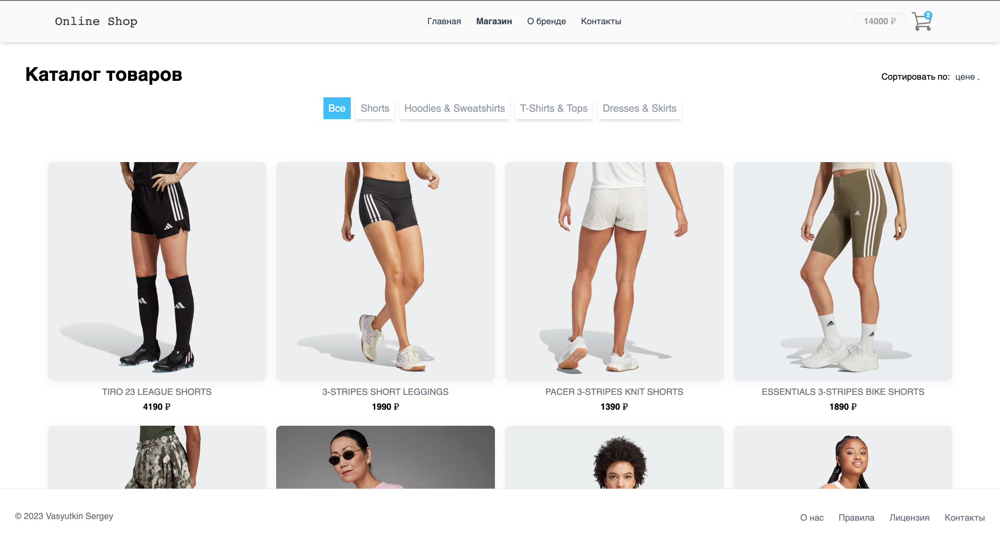
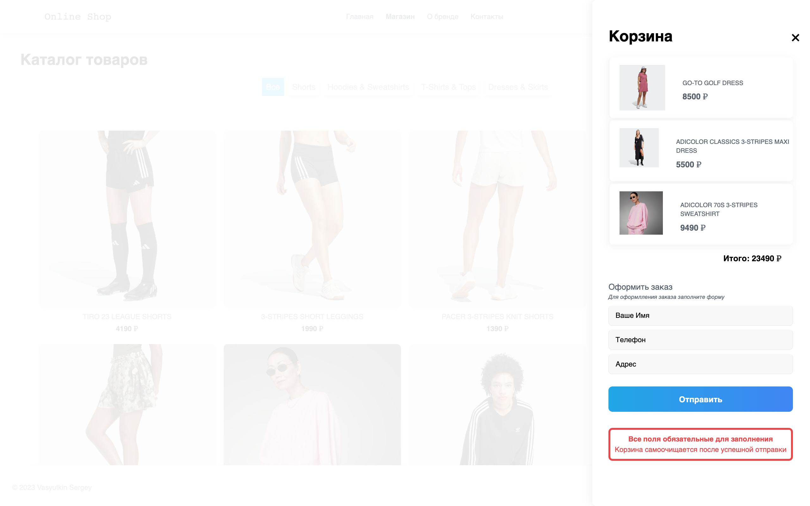

# Интернет-магазин фирменной одежды

## Дэплой
______

___

## Функционал
___________

+ Товары можно добавлять в корзину
+ Товары можно удалить из корзины
+ Фильтрация товара по категориям
+ Фильтрация товара по цене
+ Фильтрация товара по рейтингу
+ Фильтрация товара по категории
+ Адаптивный дизайн

# Стек
+ Vue 3 Composition API
+ NUXT 3
+ Tailwindcss
+ Pinia
+ Hasura (GraphiQL REST)

# Установка

1. Для запуска на локальной машине необходимо:

    Установить npm зависимости:

        npm install

2. Запустить в режиме разработки:
   
        npm run serve

   Если все прошло успешно, проект будет запущен на http://localhost:8080
